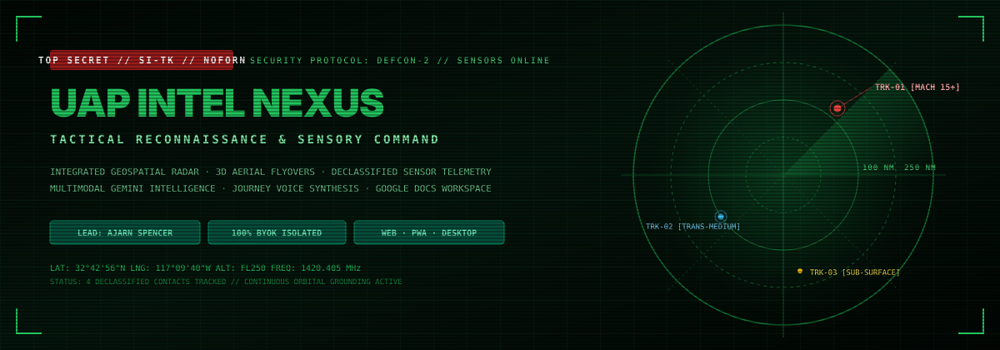

# UAP INTEL NEXUS (UAPHUB) — TACTICAL RECONNAISSANCE & SIGHTING COMMAND

<p align="center">
  
</p>

<p align="center">
  
  
  
  
  
  
  
</p>

---

## 🛰️ EXECUTIVE OVERVIEW

**UAP Intel Nexus** (also known as **UAPHub**) is an advanced tactical aerial phenomena tracking console and intelligence synthesis workstation developed under the supervision of **Ajarn Spencer Littlewood**. 

Built for defense researchers, investigative analysts, and aerospace observers, the platform aggregates real-time global UAP/UFO encounter telemetry, sensor intercepts, and declassified incident dossiers into an interactive 3D Earth Globe simulation and tactical GIS radar grid—operating **100% locally with zero paid map API dependencies**.

By synthesizing real-time search grounding, multimodal visual reconstructions (**Nano Banana Pro** photographic surveillance and **KH-11 top-down satellite reconnaissance**), budget-conscious kinematic event video simulations (**Veo 3.1 Lite**), and multi-voice neural audio briefings, UAP Intel Nexus delivers an end-to-end command deck for anomalous phenomena monitoring.

---

## 🔐 CLIENT-SIDE BYOK (BRING YOUR OWN KEY) SECURITY GATEWAY

### Strict 100% Client-Side Sandbox (`localStorage`)
To guarantee privacy and protect classified research dossiers, UAP Intel Nexus enforces a strict **Bring Your Own Key (BYOK)** architecture:

1. **Zero External Logging**: Your Google Gemini API keys and Google Workspace OAuth access tokens remain exclusively inside your browser sandbox (`localStorage`). Keys are **never** proxied, logged, or transmitted to any third-party server.
2. **Direct Browser Execution**: All calls to `@google/genai` (text briefing, TTS audio, Nano Banana Pro image generation, Veo video simulations, and Search Grounding) run directly from client-side Web APIs.
3. **Instant Revocation**: Clicking **REVOKE KEY** in the navigation header flushes all cryptographic tokens, cache items, and session storage immediately.
4. **Zero-Config Demo Preview Mode**: Built-in demonstration telemetry allows immediate exploration of historical declassified incident files (Nimitz Tic-Tac, Aguadilla, Gimbal/GoFast, Andaman Sea) without requiring an API key.

👉 **Get Your Official Google AI Studio API Key**:  
[https://aistudio.google.com/app/apikey](https://aistudio.google.com/app/apikey) *(Opens in a new tab; free tier supported).*

---

## ⚡ COMPLETE FEATURE BREAKDOWN

### 1. Tactical Geospatial Radar Grid & 3D Rotating Earth Globe (`components/UAPTacticalMap.tsx`)
- **Zero Paid Map Dependencies**: Built entirely with custom HTML5 Canvas rendering—no Google Maps Platform billing, Mapbox tokens, or external API keys needed.
- **Interactive 3D Earth Globe Simulation**: Continuous rotational 3D Earth sphere with realistic continent coastlines, latitude/longitude graticule lines, glowing atmospheric edge, and real-time sweeping radar beam.
- **Zoomed 2D Planar Tactical Radar**: Switch smoothly from 3D orbital view to planar tactical radar (2X to 14X zoom levels) featuring concentric range rings, azimuth bearings, and GPS coordinate lock.
- **Tactical Display Modes**: Toggle between **Hybrid**, **Satellite**, and **Vector** dark cyber themes.
- **Active Incident Blips**: Interactive target beacons with proximity distance readouts (km and miles), hover telemetry cards, and locked reconnaissance target inspector.

### 2. Live Global Sighting Ingest & Sensor Grounding (`services/newsService.ts`)
- **Gemini Search Grounding**: Continuously searches the open web and defense reporting channels (MUFON, NUFORC, The Debrief, AARO.mil, DoD Historical Archives) for the latest verified sightings within the last 48 hours.
- **Automatic Geolocation Triangulation**: Automatically resolves physical locations, sector boundaries, and coordinates, computing real-time relative distance from the observer.

### 3. Multimodal Intelligence Dossiers in 4 Analyst Personas (`components/AnalysisModal.tsx`)
- **Four Distinct Perspectives**:
  - 🏛️ **Academic**: Methodical, scientific, sensor-calibrated analysis referencing physics, radar cross-sections, and peer-reviewed aerospace metrics.
  - ⚡ **Gonzo**: High-octane, immersive field-journalist narrative putting the reader directly at the encounter perimeter.
  - 🔍 **Skeptic**: Rigorous critical investigation evaluating sensor artifacts, optical illusions, thermal blooming, and mundane explanations.
  - 🌐 **Viral**: Fast-paced, high-engagement briefing optimized for public disclosure broadcasts.

### 4. Nano Banana Pro Photographic Surveillance Reconstructions (`services/geminiService.ts`)
- **Multi-Tier Image Model Cascade**:
  - **Tier 1**: **Nano Banana Pro (`gemini-3-pro-image`)** in 1K 16:9 widescreen.
  - **Tier 2**: Nano Banana 2 (`gemini-3.1-flash-image`).
  - **Tier 3**: Nano Banana Lite (`gemini-3.1-flash-lite-image`).
  - **Tier 4**: Imagen 3 (`imagen-3.0-generate-002`).
  - **Tier 5**: Procedural Forensic Sensor Simulation Canvas (offline/quota fallback).
- **35mm Optical Surveillance Fidelity**: Synthesizes photorealistic reconnaissance camera frames matching the exact real-world geography, atmospheric conditions, and observed vehicle morphology.
- **Direct Asset Export**: 1-click download of generated high-res `.png` photos.

### 5. Top-Down Satellite Reconnaissance Imagery (`services/geminiService.ts`)
- **Post-Report Landmark & Geolocation Prompting**: Formulates satellite imagery prompts **after** the dossier text is generated, extracting geographical landmarks, terrain features, and sighting telemetry directly from the report.
- **NRO KH-11 Orbital Pass Simulation**: Top-down orthorectified satellite optical imagery capturing recognizable landforms, ocean bathymetry, desert bedrock, mountain shadows, or runway corridors.
- **Classified Header & Telemetry**: Overlaid with military KH-11 telemetry banners, coordinates, optical ground sample distance (GSD), and multispectral infrared thermal anomaly indicators.
- **1-Click Export**: Instant download of `.jpg` satellite captures and re-generation capabilities.

### 6. Veo 3.1 Lite Tactical Event Video Simulation (`services/geminiService.ts`)
- **Action-Cam Drone Flyover Prompting**: Formatted using standardized telemetry flight logs (`Telemetry Flight Log`, `Sensors: 3D Photogrammetry`, `Duration: 10s Orbital Heli-Sweep`, `360° Heli-Orbit`, `Pre-Rendered Corridors`, and `Incident Occurrence` landmarks).
- **Scenery & Content Uniformity**: Feeds the Nano Banana Pro photographic reconstruction directly into the video engine as reference scenery, ensuring visual continuity between photo, terrain, and video.
- **Dynamic Physics & Refraction**: Animates smooth 3D drone camera flyovers across the terrain, depicting the banking metallic craft with a translucent refractive gravitational lens distortion field around its hull.
- **Classified Surveillance HUD**: Overlaid with corner metadata (`TOP SECRET // [SECTOR]`, `FRAME 84-OH 35MM-OPTICAL // 01:46 PM // F/2.8 1/500 ISO 3200`).
- **Multi-Spectrum Switching**: Instant toggle between **Optical**, **FLIR Thermal**, and **NVG Night Vision** spectrum filters.
- **Zero-Error Quota Fallback**: Gracefully catches restricted video tier responses and activates high-fidelity client-side canvas-rendered simulation without throwing errors.

### 7. Neural Audio Briefings & Voice Synthesis (`services/geminiService.ts`, `utils/audioUtils.ts`)
- **Gemini TTS Engine**: Real-time neural voice synthesis using `gemini-3.8-flash-lite-tts` with Journey voice personas (`Fenrir`, `Kore`, `Puck`, `Charon`, `Aoede`, etc.).
- **RIFF Header Chunk Parsing**: Correctly parses RIFF/WAVE chunks to extract raw PCM audio data before concatenation, eliminating metallic screeching, pop artifacts, and mid-word audio truncation.
- **Smart Speech Preparation**: Translates markdown headers, classification banners, and decimal numbers (`3 point 8 seconds`) into natural verbal speech.

### 8. Export Deck & Google Docs Synchronization
- **Client-Side PDF Dossier Generation**: Formatted PDF export featuring declassified cover pages, military classification stamps, and embedded visual intelligence.
- **Raw Markdown Export**: 1-click copy and `.md` file download.
- **1-Click Google Docs Integration**: Direct export to Google Drive/Docs using client-side OAuth 2.0 without server proxies.

---

## 💻 MULTI-PLATFORM DEPLOYMENT & LOCAL SETUP

### Web & Progressive Web App (PWA)
UAP Intel Nexus includes a complete Web App Manifest (`public/manifest.json`) and service worker configuration, supporting standalone installation on Android, iOS, Windows, macOS, and Linux with custom launch shortcuts.

### Multi-Platform GitHub Actions Matrix Workflows
- `.github/workflows/ci.yml`: Automated CI validating TypeScript compilation (`tsc --noEmit`) and production bundling on all commits.
- `.github/workflows/build-multiplatform.yml`: GitHub Actions matrix pipeline packaging release binaries:
  - **Windows**: `uap-intel-nexus-windows-installer.exe` and `.zip`
  - **macOS**: `uap-intel-nexus-macos.dmg` and `.zip`
  - **Linux**: `uap-intel-nexus-linux.AppImage` and `.tar.gz`
  - **Android & Web PWA**: `uap-intel-nexus-pwa-android-web.zip`

### Local Development Setup
```bash
# 1. Clone the repository
git clone https://github.com/ajarnspencer/uap-intel-nexus.git
cd uap-intel-nexus

# 2. Install dependencies
npm install

# 3. Start local development server on port 3000
npm run dev

# 4. Verify TypeScript and compile production build
npm run lint
npm run build
```

---

## 🛠️ ARCHITECTURE & TECH STACK

| Layer | Technology | Purpose |
| :--- | :--- | :--- |
| **Frontend Framework** | React 19 + TypeScript 5.8 | Reactive component tree, hooks, and strict type safety |
| **Build & Tooling** | Vite 6.2 | Ultra-fast bundling, HMR, and production tree-shaking |
| **Styling & Theme** | Tailwind CSS v4 | Dark cyber tactical command UI with high-contrast CRT styling |
| **3D Geospatial Engine** | HTML5 Canvas 2D/3D Math | Custom 3D Earth globe projection & tactical radar (zero map dependencies) |
| **Generative Intelligence** | `@google/genai` (Gemini SDK) | Dossier text synthesis, Search Grounding, and reasoning |
| **Photographic Surveillance**| Nano Banana Pro (`gemini-3-pro-image`) | 1K 16:9 photorealistic 35mm optical reconnaissance frames |
| **Satellite Imagery** | Nano Banana Pro / Imagen 3 | Orthorectified top-down KH-11 military observation satellite imagery |
| **Kinematic Video Sim** | Veo 3.1 Lite + HTML5 Canvas | Drone action-cam flyovers with refractive gravitational lens fields |
| **Neural Speech Audio** | Gemini TTS + Journey Voices | Neural verbal briefings with clean RIFF PCM concatenation |
| **Document Export** | jsPDF + Google Docs OAuth | Client-side classified PDF generation and cloud document synchronization |
| **Security Architecture** | 100% Client-Side BYOK | `localStorage` sandbox, zero proxying, zero key transmission |

---

## 📜 LEADERSHIP & ATTRIBUTION

- **Project Lead & Architecture**: Ajarn Spencer Littlewood
- **Platform**: UAP Intel Nexus (UAPHub)
- **Security Paradigm**: 100% Client-Side BYOK Isolation
- **License**: MIT Open Source
